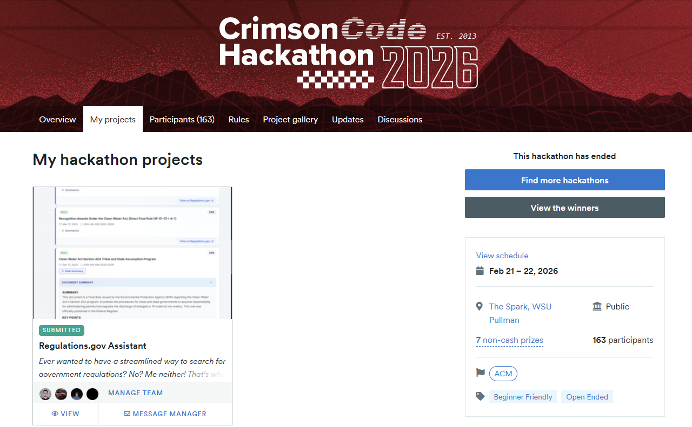
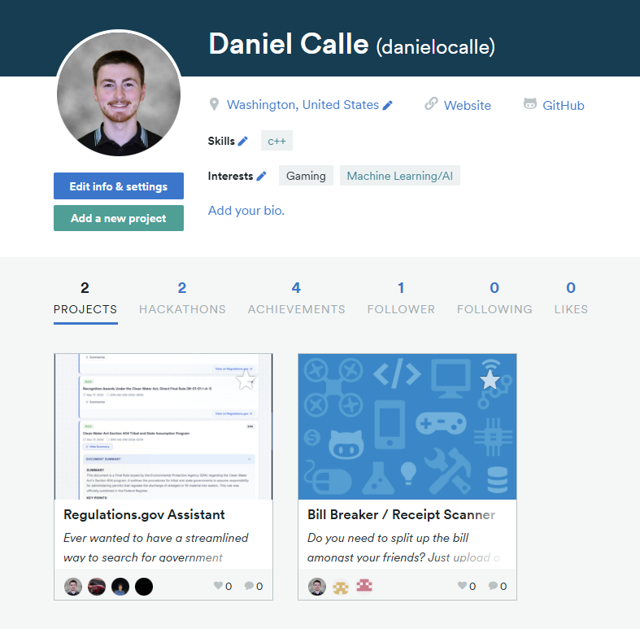
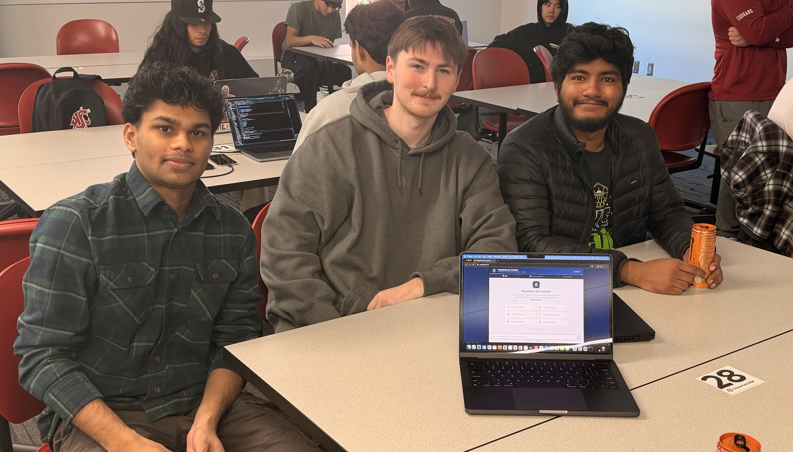
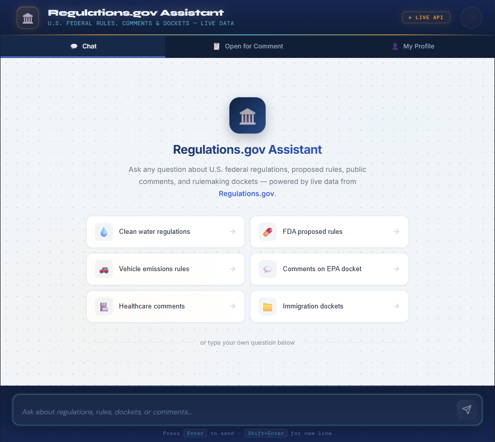
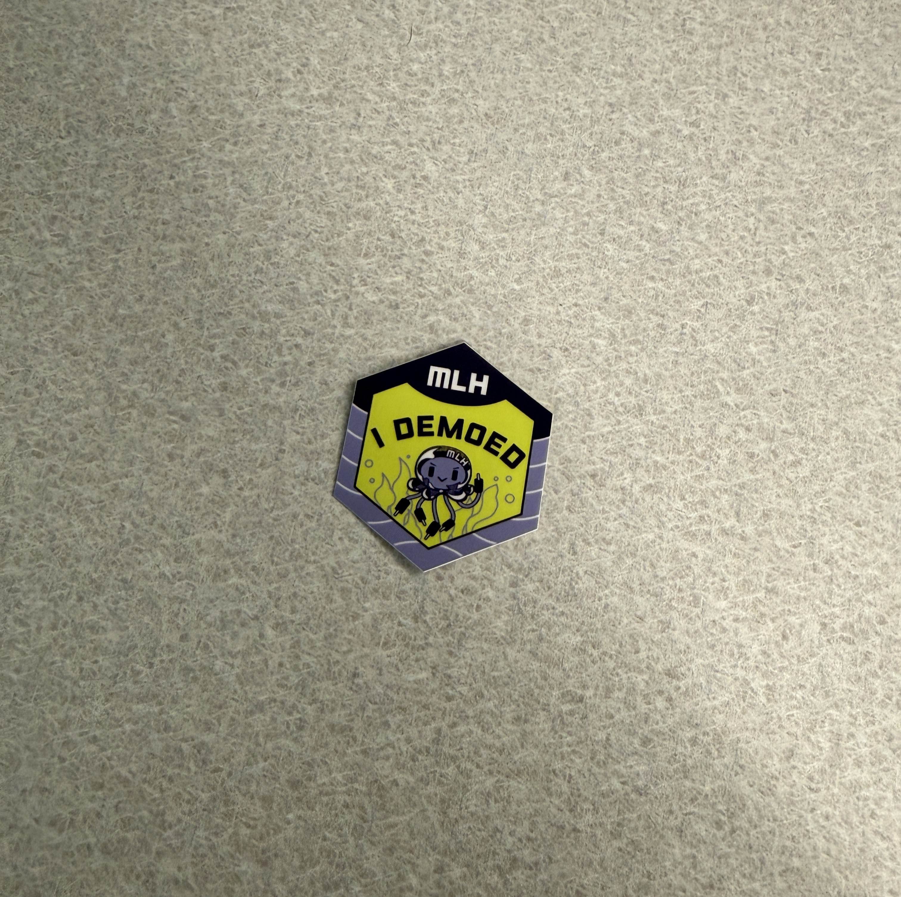

# Crimson Code Hackathon 2026

This repository contains proof of participation in the Crimson Code Hackathon event that took place February 21st–22nd, 2026. This serves as documentation of my extracurricular involvement for professional portfolio purposes and academic record keeping.

## Event Details

### Location and Date
- Pullman, Washington at the Washington State University Campus (Spark Building)
- February 21st–22nd, 2026  

### Type of Event
- 24-Hour Hackathon  

### Theme
***Reinventing the Wheel***

The theme challenged participants to rethink, modernize, or creatively redesign existing systems, tools, or everyday solutions.

## Photos and Screenshots

Below are relevant photos and screenshots demonstrating participation in the Crimson Code Hackathon.

### Event Participation
   

---
### Team Collaboration

---
### Application

---
### Proof of Project Demo
   
